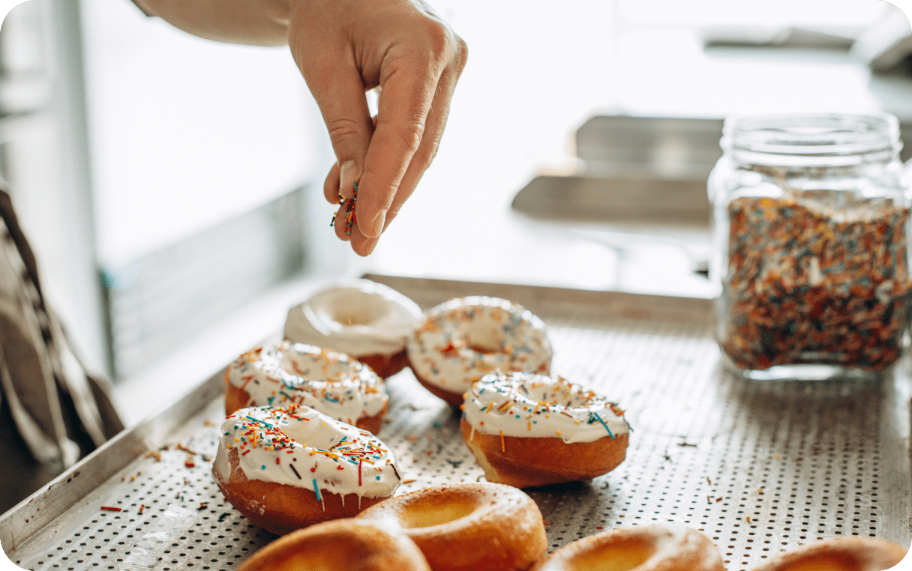

# OH MY DONUT

## Stack of technologies:

## Project description

Oh My Donut is the shop which adores tasty deserts and spend hours to create sophisticated donuts
which will save the world!

Eva has been baking since she was six years old and over the last 49 years, she has created hundreds
of cakes for weddings and has baked for many celebrities. Eva and our shop have received multiple
awards & recognition for excellence.

We are going to teach you how to cook with passion and sparkles in your eyes! We love what we do and
believe you will enjoy our cooking atmosphere!

https://dmytro1117.github.io/oh-my-donut/
